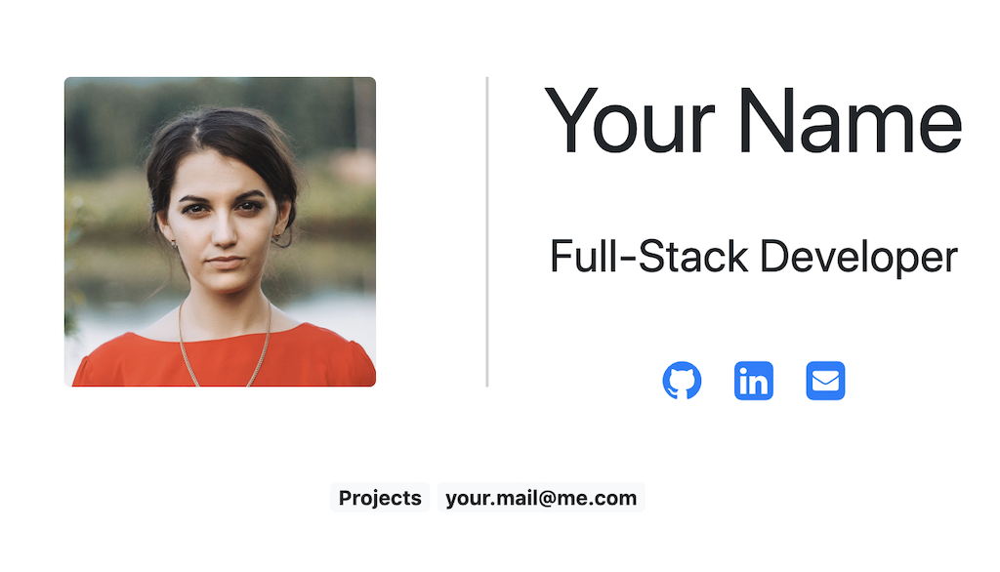
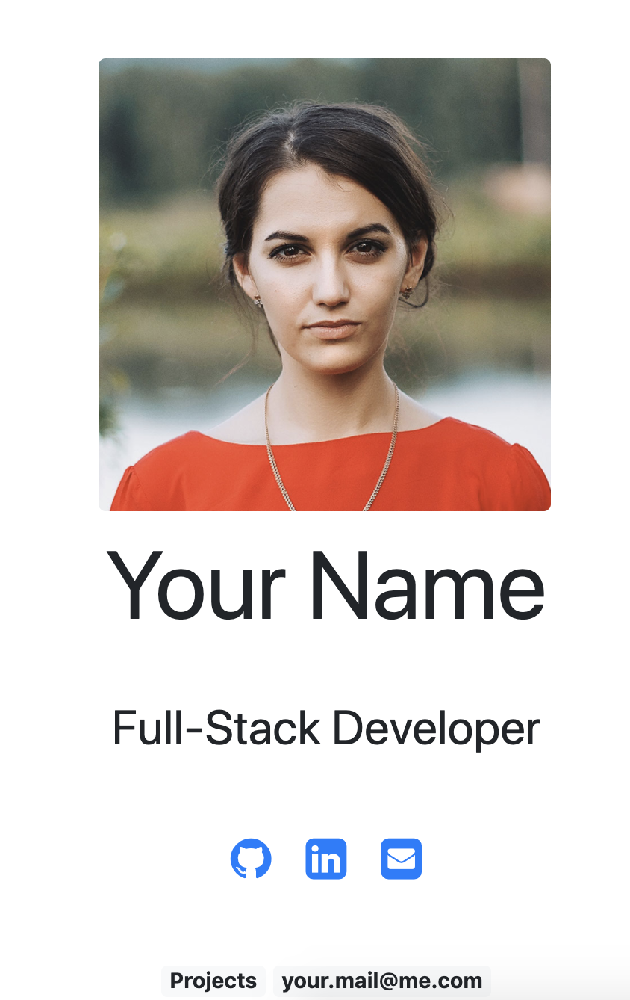

# Bootstrap Portfolio Demo Project

A small **minimal Portfolio** with bootstrap based on [sivanesh-s.github.io](https://sivanesh-s.github.io/portfolio-minimal/)
with [GitHub Actions](https://github.com/features/actions) for continuous build/deployment to [github pages](https://pages.github.com/).

## Responsive
Like the original it is based on, this is responsive.

### Large Screen

### Medium Screen

### Small Screen

